# The Waypoint

My website is designed to allow user free reign to search and score games. The site features a search function that scans one of the largest video game databases to return some results back. Users can quickly find games and find out lots of information realting to them. The site is made with the intention of making video game data acccessible quickly and efficiently. Users can also create their own profile page, here they can display some basic information about themselves, as well as games they have played. This introduces a social element to the site which encourages sharing profiles and logging all the games users own.

[Link to Deployed site](https://the-waypoint.herokuapp.com)

## UX

### CRUD

User Profile - Create, Read, Update, Delete
Games - Create (on new game), Read
Reviews - Create, Read, Delete

### Strategy Plane

The Waypoint is intended to be a community hotspot for gamers to share and score their favourite games. The design of the site will use graphics and elements familiar to this community to make the site more welcoming.

#### Ideal User

- Someone who loves video games and wants to find information about them
- Someone who wants to share their gaming collection with friends and strangers
- Someone who wants to score video games in a similar manner to something like Letterboxd
- Someone who wants to write reviews and wants to gain some real world practise.

### User Stories

[Project was Managed on Trello](https://trello.com/b/trtyq0hz/the-waypoint)

1. Django Epic
    - User Story - Django Setup: As a Developer, I want to set up Django and install any libraries that may be needed to start development.
        - Acceptance Criteria: After using pip to install Django and creating a project, Django will notify me that it has installed successfully after attempting the runserver command
    - User Story - Secret Keys: As a Developer, I want to create hidden variables and secret keys stored in an env file so that I do not leak any important credentials.
        - Acceptance Criteria: All keys necessary to development will be stored within a variable rather than displaying the key in any project files
    - User Story - Heroku Deployment: As a Developer, I want to Deploy my project to Heroku so that the website can be accessed with all of the libraries and requirements available.
        - Accetpance Criteria: The site will be accessible via a live Heroku link. All features/libraries from the development version will carry over to the live Heroku version

2. Search Epic
    - User Story - Search Game: As a user, I want to search for games, so that I can view details relating to my query and find the game I'm looking for.
        - Acceptance Criteria: Style search and search results page. Make an API call when a query is given from the user. Display query results in search results page
    - User Story - View Game: As a User, I want to view a game page so that I can access all the available information relating to it.
        - Acceptance Criteria: Create and style game page template. Allow users to click on a featured game or search for a specific one. Display all information on the game using the IGDB API.
3. Profile Epic
    - User Story - Create Account: As a user, I want to create an account, so that I can log in to the site using a username and password.
        - Accetpance Criteria: Allauth set up with working links. Related sign up pages will be styled and accessible to user
    - User Story - Create Profile: As a User, I want to create a profile, so that I can share information about my self and present it on a profile page.
        - Acceptance Criteria: On the creation of an account a Profile will be automatically Generated.
    - User Story - Log In/Out: As a user, I want to log in and out of my profile so that I can access the site from multiple devices and keep my profile secure
        - Acceptance Criteriia: Style login/out pages. Ensure there is a log out confirmation to prevent accidental logouts. Allow the user to log in to their account using their credentials secured on the database.
    - User Story - View Profile: As a User, I want to view my profile page so that I can view all of my information and share my games
        - Acceptance Criteria: Create and style profile.html page. Display current profile data from the database.
    - User Story - Edit Profile: As a user, I want to edit my profile so that I can update it with up to date and correct information.
        - Acceptance Criteria: Create and style edit profile page. Create a function to update database with new user information

### Skeleton Plane

#### Wireframes

Home page: The home page will welcome the users to the site and give a clear description as to the purpose of the site. The graphics will be familiar to gamers to make sure they immedietly feel welcome.

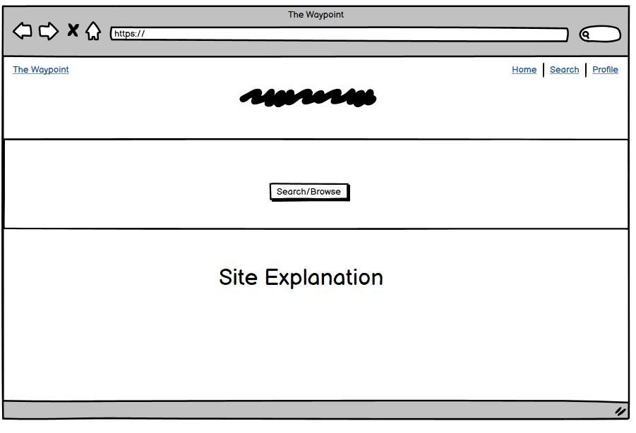

Search Page: The search page will give the user a clear idea of where to enter their search query and allow the user to easily type it in and search bringing them to a search results page. This standard procedure should be familiar to most users.

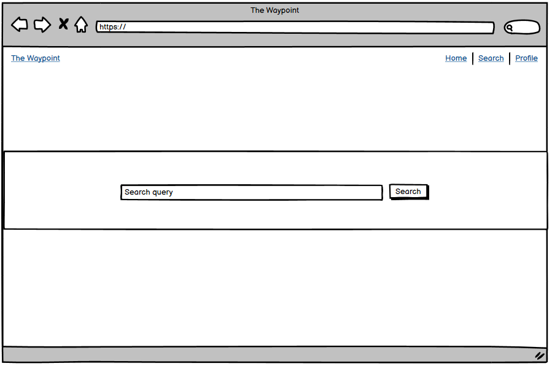

Search Results: The search results page will render the user query onto the page presented in cards. The cards will contain an image of the game as well as the name of the game. Clicking on the image will bring the user to the specific game page.

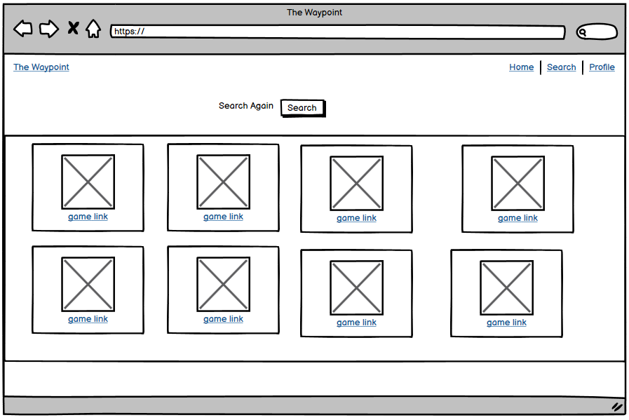

Game Detail Page: The game detail page will render the information relating to the game ID that was selected on the results page. It will make a call to the API to get all this information and display in a card.

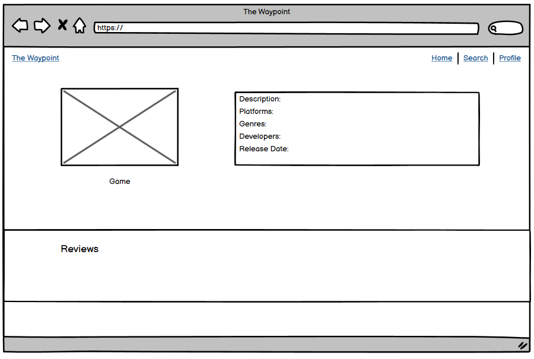

Profile Page: Each user will have a profile page that will display the users profile picture as well as their user information that they entered into the database.

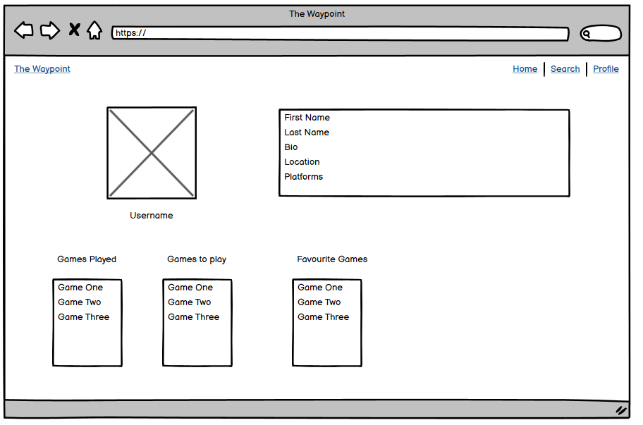

### Surface 

- Font

The main font I selected for headings was Ubuntu and the body was Noto Serif.

- Colours

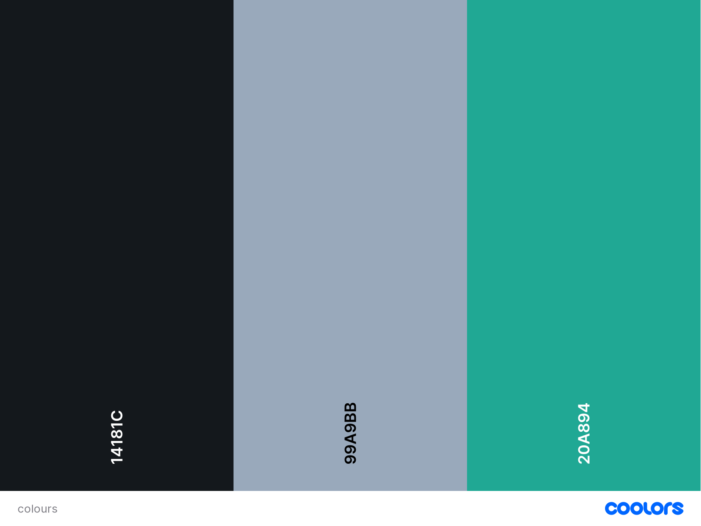

### Database Schema

## Features

Home Page:

The Home Page welcomes the user into the site with a clear heading and description as to what the site does. From here the user can easily find the search features located under the primary image with a heading. This brings the user to the search page as the main call to action.

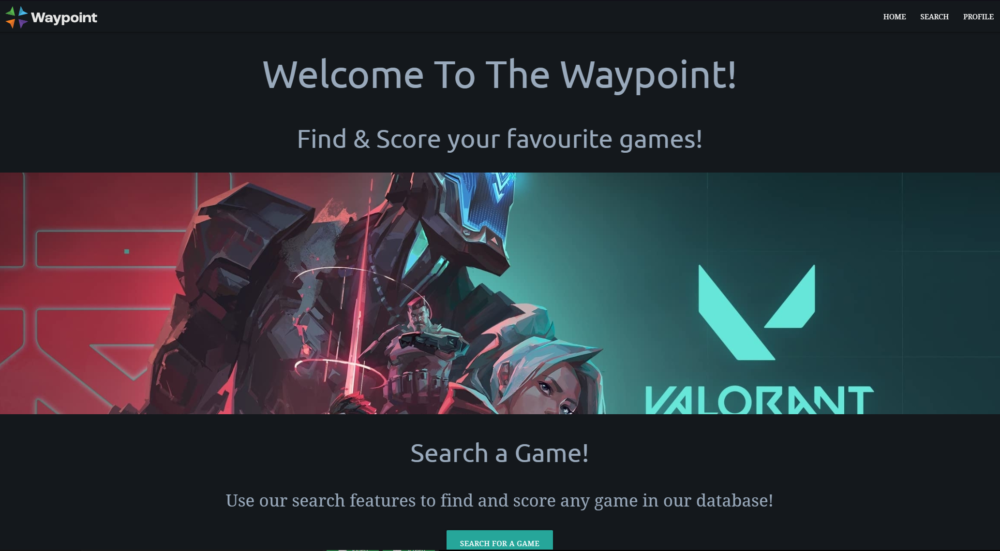

Nav Bar: The nav bar has a simple design that makes it easy for the user to find available links and the site logo. Clicking on the site logo will also bring the user to the home page from any other page on the site. The links are capitalized and easy to locate.

On mobile the nav bar will squish down into a "burger bun" icon which when pressed will present the user with the nav bar options

Game Search:

The game search is the main function of the site, the user is given a clear window as to where the search bar is and how to go through with the search. Whatever the user types will be saved as a query to render the search results page with.

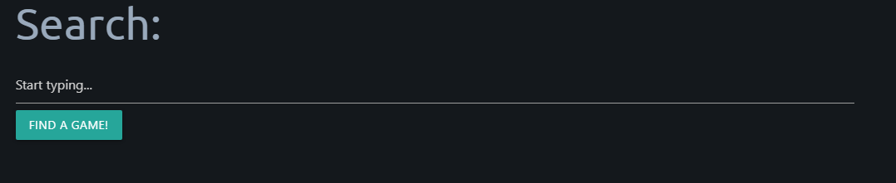

USER STORY: Search Games:

    - As a user, I want to search for games, so that I can view details relating to my query and find the game I'm looking for.

Acceptance Criteria:
Style search and search results page
Make an API call when a query is given from the user
Display query results in search results page

The game search screen begins the first part of this User story by taking the query from the search bar based on the user entry. This will then be forwarded onto the search_results page. 

Game Cards:

The game card page will render the search query that the user has provided. For each search result a new card will be rendered. To prevent putting too many on one page a limit of 12 per page has been set to ensure the user does not also get overwhelemd with choice. To ensure more accurate searches an API setting has been made to order the games by metacritic rating. This means it is less likley to put user made or fan games high on the list when making a general query.

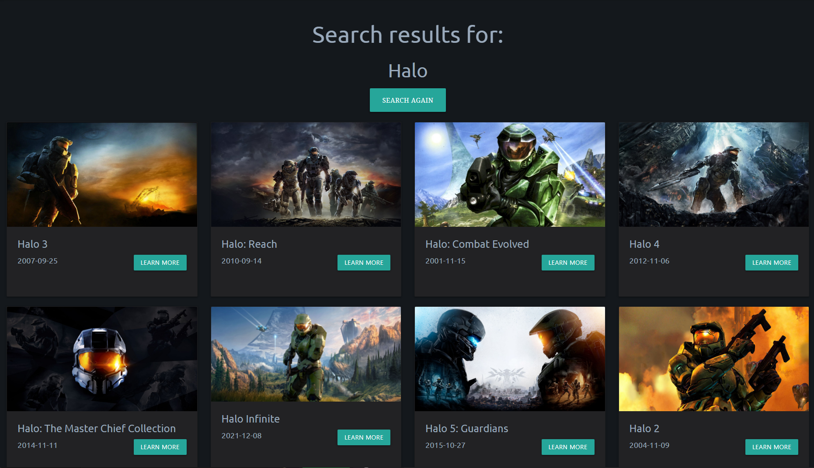

USER STORY: Search Games:

    - As a user, I want to search for games, so that I can view details relating to my query and find the game I'm looking for.

Acceptance Criteria:
Style search and search results page
Make an API call when a query is given from the user
Display query results in search results page

This fuffils the second part of the User Story to search a game. The search results page when loaded will take the query and pass it to the API url in order to render the specific user query. This will then all be rendered in a styled format using the game cards to turn the JSON information into easily viewable information for the user.

Game Page:

The game page takes the ID of the game and matches it to the API to render information about it clearly to the user. It has an image card to match the game art to the descripttion. This is more likley to give the user confirmation that they have found the correct game. Similarly the information on the side of the image is also detailed with the game description, release date, platforms, genres and developers. This gives the user all the quick information they could want to find on a game.

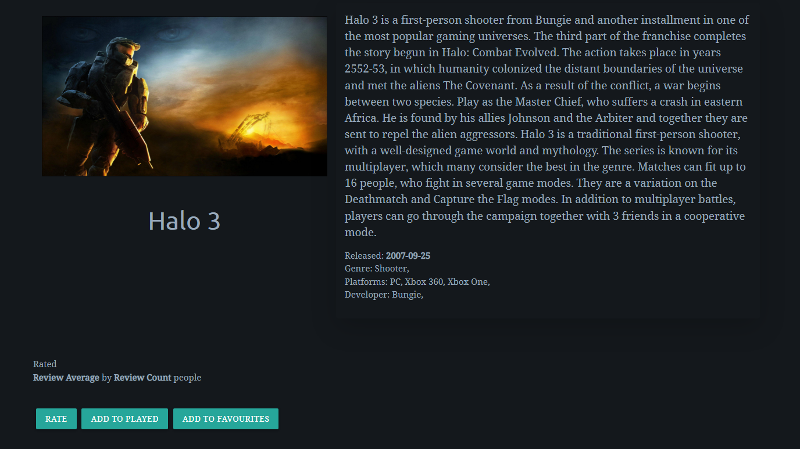

USER STORY: View Game

    - As a User, I want to view a game page so that I can access all the available information.

Acceptance Criteria:
Create and style game page template
Allow users to click on a featured game or search for a specific one
Display all information on the game using the IGDB API.

The Game Page fufils all this User Story by first having the styled game page displaying all the game information in a user friendly experience. Clicking on a featured game has become part of the Browse Games user story and will be moved to a future update. However the user is able to search for a specific game and have the information rendered by passing a further query to the API from the search results page. The IGDB API was also changed for thhe RAWG.io API, this works the same however and still displays all the intended information for the User.

Reviews: 

The Review section under a game details page will display the user reviews for the sellected game. It will display a limited preview to make sure the page is not taken up by lengthy reviews and instead opts the user to click a "View Review" button which will show just the specified review in full detail. Here the review author is given the option to delete their review if they ever want to make a new review or if they are unhappy with the old one.

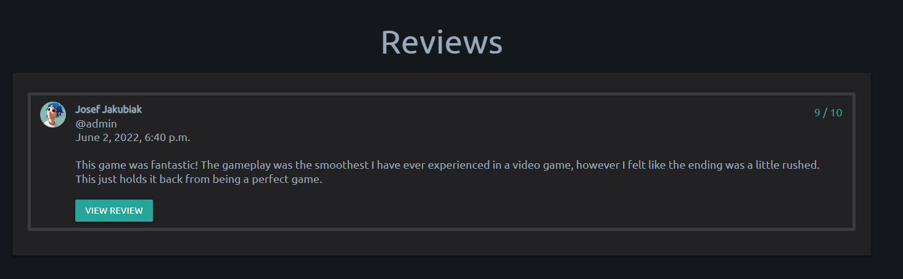

USER STORY: Review Game

    - As a User, I want to review a game so that I can have my public opinion shown on a game page.

Acceptance Criteria:
Create and style a review form
Save the review to the database with a connection to the game ID that matches it.
Display review data on game page

All this criteria is met, a review form is collected and stored into the database which is then rendered onto the game details page for the gameID that matches the gameID from the review. These two together ensure the correct review is on the matching game. This ensures that users can easily share their opinions and be able to find them in an easy to understand manor.

Profile Page:

Whenever a user account is created a Profile page is also generated for the user. From here the user can display their profile picture in a similar design to the game details to have uniform design. Similarly there is a section next to the image that a user can fill in with personal details to personalize their profile page. If the user is signed in and viewing their own page they will be able to see the Edit Profile button.

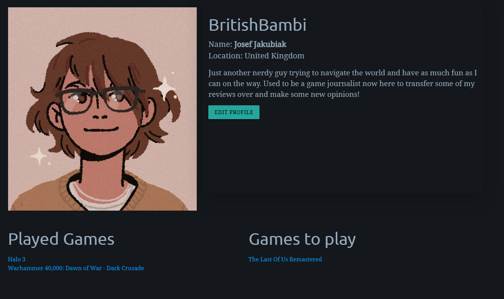

Edit Profile:

The edit profile page allows easy acccess for the user to update profile information as well as account details. Links here from allauth are provided to change/verify email and also change password. The rest is all for the profile page which will update the database whenever it is filled out and the user presses the update button.

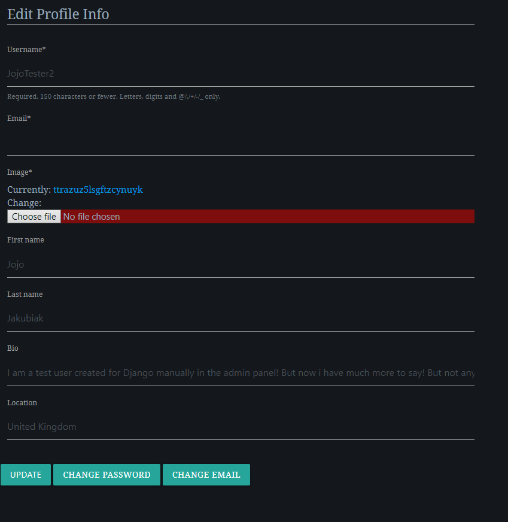

USER STORY: Edit Profile

    - As a user, I want to edit my profile so that I can update it with up to date and correct information.

Acceptance Criteria:
Create and style edit profile page
Create a function to update database with new user information

Edit profile is a simple user need and is met just as easily. A form is collected and passed through the view to update the database and user profile page with the new information provded by the user

## Future Features

For the furture of the site I have several updates that are planned. Either I did not have enough time to implement them or the amount of knowledge required to make them correctly.

### Browse Games

The main feature that I have planned is for a browse page easily accessible from the Navbar and home page. This page would render a list of recently modified and popular games from the API. The intent of this feature would be to make finding new games accesible and easy to users. Here it would be easier to contribute to active discussions and find games that have been reviewed by other users. This would make use of inbuilt API URL queries to render popular games from a certain platform/time period or genre with ease. 

### Review Comments/Likes

This would allow further input and interaction from Users. Forms would be created so that comments would be left under reviews that could be liked or disliked to reflect public opinion. This would add a deeper user meaning to reviews and would inspire discussion on Reviews themselves rather than the game in general. This would be an ideal feature to add next into the project.

## Testing

## Technologies

- HTML
    - HTML was used as the base language for the templates created for the site.

- Bootstrap
    - Bootstrap was used for general layout and spacing requirements for the site.

- Materialize CSS
    - Materialize was used to style certain elemetns with matching style across the site.

- Django
    - Django was used as the main python framework in the development of this project

- Python
    - aiohttp==3.8.1
    - aiosignal==1.2.0
    - asgiref==3.5.1
    - async-timeout==4.0.2
    - cloudinary==1.29.0
    - dj-database-url==0.5.0
    - dj3-cloudinary-storage==0.0.6
    - Django==3.2.13
    - django-allauth==0.50.0
    - django-crispy-forms==1.14.0
    - frozenlist==1.3.0
    - future==0.18.2
    - gunicorn==20.1.0
    - multidict==6.0.2
    - oauthlib==3.2.0
    - protobuf==3.20.1
    - psycopg2==2.9.3
    - PyJWT==2.4.0
    - pylint-django==2.5.3
    - pylint-plugin-utils==0.7
    - python3-openid==3.2.0
    - pytz==2022.1
    - requests-oauthlib==1.3.1
    - sqlparse==0.4.2
    - yarl==1.7.2

- Heroku
    - Was used as the cloud based platform to deploy the site on

- Heroku PostgreSQL
    - Was used as the live database.

- RAWG API
    - Was the API used to call and render game details

## Deployment

The site was deployed via Heroku

### Project Deployment

The steps to deploy this project were simple and are as followed: 
- Sign up / Log in to Heroku
- From the main Heroku Dashboard page select 'New' and then 'Create New App'
- Give the project a name and select a suitable region, then select create app. The name for the app must be unique.
- This will create the app within Heroku and bring you to the deploy tab. From the submenu at the top, navigate to the resources tab.
- Add the database to the app, in the add-ons section search for 'Heroku Postgres', select the package that appears and add 'Heroku Postgres' as the database
- Navigate to the setting tab, within the config vars section copy the DATABASE_URL to the clipboard for use in the Django configuration.
- Within the django app repository create a new file called env.py - within this file import the os library and set the environment variable for the DATABASE_URL pasting in the address copied from Heroku. - - The line should appear as os.environ["DATABASE_URL"]= "Paste the link in here"
- Add a secret key to the app using os.environ["SECRET_KEY"] = "your secret key goes here"
- Add the secret key just created to the Heroku Config Vars as SECRET_KEY for the KEY value and the secret key value you created as the VALUE
- In the settings.py file within the django app, import Path from pathlib, import os and import dj_database_url
- insert the line if os.path.isfile("env.py"): import env
- remove the insecure secret key that django has in the settings file by default and replace it with SECRET_KEY = os.environ.get('SECRET_KEY')
- replace the databases section with DATABASES = { 'default': dj_database_url.parse(os.environ.get("DATABASE_URL"))} ensure the correct indentation for python is used.
- In the terminal migrate the models over to the new database connection
- Navigate in a browser to cloudinary, log in, or create an account and log in.
- From the dashboard - copy the CLOUDINARY_URL to the clipboard
- in the env.py file created earlier - add os.environ["CLOUDINARY_URL"] = "paste in the Url copied to the clipboard here"
- In Heroku, add the CLOUDINARY_URL and value copied to the clipboard to the config vars
- Also add the KEY - DISABLE_COLLECTSTATIC with the Value - 1 to the config vars
- this key value pair must be removed prior to final deployment
- Add the cloudinary libraries to the list of installed apps, the order they are inserted is important, 'cloudinary_storage' goes above 'django.contrib.staitcfiles' and 'cloudinary' goes below it.
- in the Settings.py file - add the STATIC files settings - the url, storage path, directory path, root path, media url and default file storage path.
- Link the file to the templates directory in Heroku TEMPLATES_DIR = os.path.join(BASE_DIR, 'templates')
- Change the templates directory to TEMPLATES_DIR - 'DIRS': [TEMPLATES_DIR]
- Add Heroku to the ALLOWED_HOSTS list the format will be the app name given in Heroku when creating the app followed by .herokuapp.com
- In your code editor, create three new top level folders, media, static, templates
- Create a new file on the top level directory - Procfile
- Within the Procfile add the code - web: guincorn PROJECT_NAME.wsgi
- In the terminal, add the changed files, commit and push to GitHub
- In Heroku, navigate to the deployment tab and deploy the branch manually - watch the build logs for any errors.
- Heroku will now build the app for you. Once it has completed the build process you will see a 'Your App Was Successfully Deployed' message and a link to the app to visit the live site.

### Clone Repo

Creating a clone enables you to make a copy of the repository at that point in time - this lets you run a copy of the project locally: This can be done by:

- Navigating to https://github.com/BritishBambi/The-Waypoint-PP4
- Clicking on the arrow on the green code button at the top of the list of files
- Selecting the clone by https option and copy the URL it provides to the clipboard
- Navigate to your code editor of choice and within the terminal change the directory to the location you want to clone the repository to.
- Type 'git clone' and paste the https link you copied from github
- Press enter and git will clone the repository to your local machine

### Fork Repo

By forking the GitHub Repository you can make a copy of the original repository to view or change without it effecting the original repository This can be done by logging into GitHub or creating an account.  Locate the repository at https://github.com/BritishBambi/The-Waypoint-PP4 . At the top of the repository, on the right side of the page, select "Fork" from the buttons available. A copy of the repository should now be created in your own repository.

## Bugs

During development I encountered an issue where my workspace was not correctly building and would not save files correctly. To get around this I ended up creating a new Git repository based on the CI template. This seemed to fix my issue however a small amount of progress was lost and my README needed to be done from scratch.

Part way through development my access to the gitpod workspaces was limited and I was unable to work on my project for a few days. Fortunatly this was fixed so I could continue working on my project.

## Acknowledgments

Thanks to [dev.to](https://dev.to/yahaya_hk/how-to-populate-your-database-with-data-from-an-external-api-in-django-398i) for providing the information to populate my pages and datbase with API content.

## Credits

Credit to [Julie Ucha](https://www.julieucha.com) for designing the logo and icon for the site.