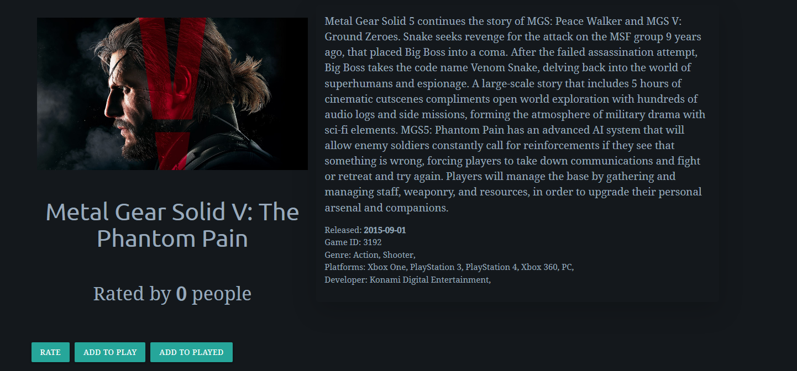

# The Waypoint

My website is designed to allow user free reign to search and score games. The site features a search function that scans one of the largest video game databases to return some results back. Users can quickly find games and find out lots of information realting to them. The site is made with the intention of making video game data acccessible quickly and efficiently. Users can also create their own profile page, here they can display some basic information about themselves, as well as games they have played. This introduces a social element to the site which encourages sharing profiles and logging all the games users own.

[Link to Deployed site](https://the-waypoint.herokuapp.com)

## UX

### Strategy Plane

The Waypoint is intended to be a community hotspot for gamers to share and score their favourite games. The design of the site will use graphics and elements familiar to this community to make the site more welcoming.

#### Ideal User

- Someone who loves video games and wants to find information about them
- Someone who wants to share their gaming collection with friends and strangers
- Someone who wants to score video games in a similar manner to something like Letterboxd
- Someone who wants to write reviews and wants to gain some real world practise.

### User Stories

[Project was Managed on Trello](https://trello.com/b/trtyq0hz/the-waypoint)

1. Django Epic
    - User Story - Django Setup: As a Developer, I want to set up Django and install any libraries that may be needed to start development.
        - Acceptance Criteria: After using pip to install Django and creating a project, Django will notify me that it has installed successfully after attempting the runserver command
    - User Story - Secret Keys: As a Developer, I want to create hidden variables and secret keys stored in an env file so that I do not leak any important credentials.
        - Acceptance Criteria: All keys necessary to development will be stored within a variable rather than displaying the key in any project files
    - User Story - Heroku Deployment: As a Developer, I want to Deploy my project to Heroku so that the website can be accessed with all of the libraries and requirements available.
        - Accetpance Criteria: The site will be accessible via a live Heroku link. All features/libraries from the development version will carry over to the live Heroku version

2. Search Epic
    - User Story - Search Game: As a user, I want to search for games, so that I can view details relating to my query and find the game I'm looking for.
        - Acceptance Criteria: Style search and search results page. Make an API call when a query is given from the user. Display query results in search results page
    - User Story - View Game: As a User, I want to view a game page so that I can access all the available information relating to it.
        - Acceptance Criteria: Create and style game page template. Allow users to click on a featured game or search for a specific one. Display all information on the game using the IGDB API.
3. Profile Epic
    - User Story - Create Account: As a user, I want to create an account, so that I can log in to the site using a username and password.
        - Accetpance Criteria: Allauth set up with working links. Related sign up pages will be styled and accessible to user
    - User Story - Create Profile: As a User, I want to create a profile, so that I can share information about my self and present it on a profile page.
        - Acceptance Criteria: On the creation of an account a Profile will be automatically Generated.
    - User Story - Log In/Out: As a user, I want to log in and out of my profile so that I can access the site from multiple devices and keep my profile secure
        - Acceptance Criteriia: Style login/out pages. Ensure there is a log out confirmation to prevent accidental logouts. Allow the user to log in to their account using their credentials secured on the database.
    - User Story - View Profile: As a User, I want to view my profile page so that I can view all of my information and share my games
        - Acceptance Criteria: Create and style profile.html page. Display current profile data from the database.
    - User Story - Edit Profile: As a user, I want to edit my profile so that I can update it with up to date and correct information.
        - Acceptance Criteria: Create and style edit profile page. Create a function to update database with new user information

### Skeleton Plane

#### Wireframes

Home page: The home page will welcome the users to the site and give a clear description as to the purpose of the site. The graphics will be familiar to gamers to make sure they immedietly feel welcome.

Search Page: The search page will give the user a clear idea of where to enter their search query and allow the user to easily type it in and search bringing them to a search results page. This standard procedure should be familiar to most users.

Search Results: The search results page will render the user query onto the page presented in cards. The cards will contain an image of the game as well as the name of the game. Clicking on the image will bring the user to the specific game page.

Game Detail Page: The game detail page will render the information relating to the game ID that was selected on the results page. It will make a call to the API to get all this information and display in a card.

Profile Page: Each user will have a profile page that will display the users profile picture as well as their user information that they entered into the database.

### Surface 

- Font

The main font I selected for headings was Ubuntu and the body was Noto Serif.

- Colours

### Database Schema

## Features

Home Page:

Nav Bar:

Game Search:

Game Cards:

Game Page:

Reviews: 

Profile Page:

Edit Profile:

## Future Features

## Testing

## Technologies

- HTML
    - HTML was used as the base language for the templates created for the site.

- Bootstrap
    - Bootstrap was used for general layout and spacing requirements for the site.

- Materialize CSS

- Django
    - Django was used as the main python framework in the development of this project

- Python
    - aiohttp==3.8.1
    - aiosignal==1.2.0
    - asgiref==3.5.1
    - async-timeout==4.0.2
    - cloudinary==1.29.0
    - dj-database-url==0.5.0
    - dj3-cloudinary-storage==0.0.6
    - Django==3.2.13
    - django-allauth==0.50.0
    - django-crispy-forms==1.14.0
    - frozenlist==1.3.0
    - future==0.18.2
    - gunicorn==20.1.0
    - multidict==6.0.2
    - oauthlib==3.2.0
    - protobuf==3.20.1
    - psycopg2==2.9.3
    - PyJWT==2.4.0
    - pylint-django==2.5.3
    - pylint-plugin-utils==0.7
    - python3-openid==3.2.0
    - pytz==2022.1
    - requests-oauthlib==1.3.1
    - sqlparse==0.4.2
    - yarl==1.7.2

- Heroku
    - Was used as the cloud based platform to deploy the site on

- Heroku PostgreSQL

- RAWG API
    - Was the API used to call and render game details

## Deployment

### Project Deployment

### Clone Repo

### Fork Repo

## Bugs

During development I encountered an issue where my workspace was not correctly building and would not save files correctly. To get around this I ended up creating a new Git repository based on the CI template. This seemed to fix my issue however a small amount of progress was lost and my README needed to be done from scratch.

Part way through development 

## Acknowledgments

Thanks to [dev.to](https://dev.to/yahaya_hk/how-to-populate-your-database-with-data-from-an-external-api-in-django-398i) 

## Credits

Credit to [Julie Ucha](https://www.julieucha.com) for designing the logo and icon for the site.