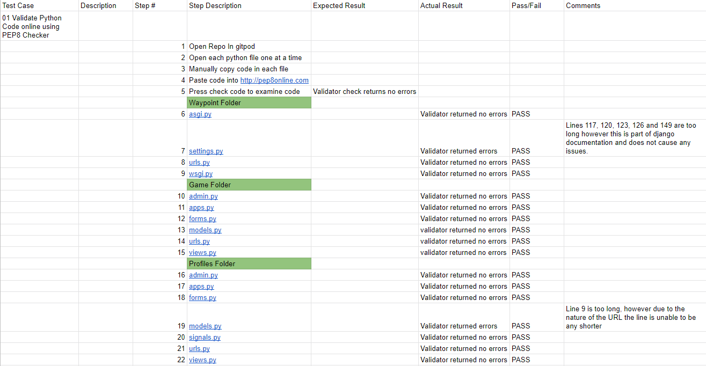

# Testing and Verifying 

## Test Case 01 - Validate Python Code online using PEP8 Checker

The Python code was checked using the pep8 validator available at pep8online.com. The code from each file was copied in its entirity and checked for errors. All the files returned no serious issues and the error codes that were given related to line length which could not be altered.

* Screenshots of the validator reports are here:
    * Waypoint Folder
        * [asgi.py file](/assets/screenshots/testing/waypoint-asgi.PNG) 
        * [settings.py file](/assets/screenshots/testing/waypoint-settings.PNG) 
        * [urls.py file](/assets/screenshots/testing/waypoint-urls.PNG) 
        * [wsgi.py file](/assets/screenshots/testing/waypoint-wsgi.PNG)
    * Profiles Folder 
        * [admin.py file](/assets/screenshots/testing/profiles-admin.PNG)
        * [apps.py file](/assets/screenshots/testing/profiles-apps.PNG) 
        * [forms.py file](/assets/screenshots/testing/profiles-forms.PNG) 
        * [models.py file](/assets/screenshots/testing/profiles-models.PNG) 
        * [urls.py file](/assets/screenshots/testing/profiles-urls.PNG) 
        * [views.py file](/assets/screenshots/testing/profiles-views.PNG)
    * Game Folder 
        * [admin.py file](/assets/screenshots/testing/game-admin.PNG) 
        * [apps.py file](/assets/screenshots/testing/game-apps.PNG) 
        * [forms.py file](/assets/screenshots/testing/game-forms.PNG)
        * [models.py file](/assets/screenshots/testing/game-models.PNG)
        * [urls.py file](/assets/screenshots/testing/game-urls.PNG))
        * [views.py file](/assets/screenshots/testing/game-views.PNG)

## Test Case 02 - Validate Javascript Online using JSHint

Due to there only being a very small amount of Javascript in the project, there was not much validation that had to be done. The 3 main functions were all imported Javascript from the materliaze documentation in order to run certain elemenets. This included the dropdown menu, materialize box and the paralax images. After selecting Jquery on the available JSHint settings, all of these were validated with no errors and work as intended.

## Test Case 03 - Validate CSS online using W3C CSS Validator

During production, the main layout of the site and most of the styling was taken care of by bootstrap and materialize. However, a reasonable amount of custom CSS was still required. This was mainly used to control the colour of certain elements, or rezise them for mobile devices. I tested the site using the Jigsaw CSS Validator service which returned no errors. I received only one warning relating to imported style sheets. If the site was checked using the URL method then the validator would return back hundreds of warnings due to the nature  of imported style sheets.

## Test Case 04 - Manual HTML Testing - Unregistered User

Due to my project relying on Django templates to render everything to the page, the option to copy and paste code online to validate is not an option. To circumvent this I will be going through each element of the website as a registered and unregistered user to ensure that everything works as intended. To ensure everything is covered I will be using a test schedule similar to my Python validation to make sure no step or site elemenet is skipped over.

### 04a - Unregistered Navigation

The overall site navigation was testing fully to ensure all links directed the user to the correct page. Since certain buttons will only appear on the dropdown menu depending on if the user is signed in, I have first tested unregistered user navigation. All the link work as intended.

### 04b - Unregistered Game Search

I then tested the game search mechanic on its own to ensure that all features and buttons work as intended. The intention is that the user is able to at least make a generic search to see what games come up but is then redirected to login in order to view any games. This is so that authentication issues do not happen relating to the user and profile model on a game page. The simple solution is to ensure that a user viewing game is signed out so their user profile can be checked against relevent lists. This also reduces the amount of API requests made by a user, and also how many total games are added to the database.

### 04c - Unregistered Sign Up/Sign in

I ensured to test the user registration process multiple times with different steps to ensure that incorrect fields and errors would display as intended in case of a user mistake. Most of this came from testing invalid user input on the sign up page. This ensures that the user can only type valid inputs into the email, username and password fields. Similarlly this also helped to test the smtp server used to send emails to users. The first email sent arrived into my junk mail folder on outlook. However using a different gmail account had the email appear in my inbox as hoped. All the email formatting and links were correct and fast to load for the user. The sign up process has been made fast and efficent using allauth and is handled for me with ease. I also used these tests on the sign in process to ensure emails and errors would work when requested by the user.

## Test Case 05 - Manual HTML Testing - Registered User

As more of the site is made available to a registered user I felt that it was important to seperate the two cases into their own catagories. This would mean that extensive testing could be performed across both groups efficiently. 

### 05a - Registered Navigation

Almost the same as unregistered navigation, when a registered user navigates the site the key difference is with the profile dropdown menu. Now when the user clicks on it 2 new options are presented and all the links in here work as intended. The extra testing comes in the edit profile function which will be done in the Registered Auth testing.

### 05b - Registered Game Search/Review

With game searching being the primary draw and function to the site there were many variables to test against to ensure that everything worked correctly and that users were authorized to do certain actions. There were several buttons that have relationships with the profile model such as the game itself and the reviews. These all work in tangent to provide information across different areas of the site. When a game is reviewed the review is stored to the game, which is then also stored to the user profile. This also allows users to understand easily who wrote what review and be able to find their profile with ease. I also ensured that any unauthorized action such as deleting someone elses review would have defences in place and a warning to the user.

### 05c - Registered Allauth Testing

This is the area of the site that required the most amount of testing. This was mainly due to the fact that users would have to be authorized to perform certain actions and a lot of elements could be changed. Through testing I was able to ensure that users could only make changes to their own account. Similar to how game review deletion worked, users are given warnings when trying to perform unauthorized actions by changing the URL to match a different user. This ensures the saftey of user accounts and that changes cannot be made on their behalf. All the profile forms and elements rendered and updated the database exactly as expected and was succesful. From the testing I was able to discover a 500 Internal server error that occureed when trying to delete a primary email. I was able to fix this issue by creating a toast specifically for erorrs.

## Automated Testing

To further test the elements of my site I used some automated testing to ensure that items could be created and saved into the database as well as retrieved. This was also very useful to ensure that all of my Views were opperating as expected. Through my testing I was able to get a total of 90% coverage across the entire website. The remaining 10% has been covered through the manual testing I achieved in this document. The main part of my views I was not auto testing was any forms. This included Edit Profile, Delete profile and Making a user review. The rest of my links have all been checked against using this automatic testing.